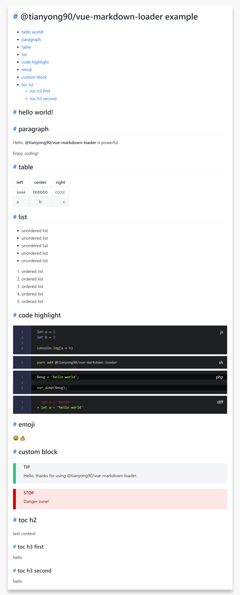

# vue-markdown-loader

This is a webpack loader that can load markdown files. With proper configuration, the loader can convert markdown file content into `vue sfc` component object or into html string, so it can be chained with vue-loader or html-loader.

The project is inspired by [vuepress](https://github.com/vuejs/vuepress), we reused most of its source code and made some improvements to allow it being used in non-vuepress project.

If you are interested in Vuepress, please visit [vuepress](https://github.com/vuejs/vuepress) and star it. :smile:



## Install

```bash
npm i vue-markdown-loader -S
```

## Usage

### Use along with vue-loader

Generally, it is recommended to be used with `vue-loader`

1. configuration

add rule for .md file in webpack.config.js

```js
module: {
  rules: [
    {
      test: /\.vue$/,
      loader: 'vue-loader'
    },
    {
      test: /\.md$/,
      use: [
        {
          loader: 'vue-loader',
          options: {
            compilerOptions: {
              preserveWhiteSpace: false
            }
          }
        },
        {
          loader: '@tianyong90/vue-markdown-loader',
          options: {
            contentCssClass: 'markdown-body',
            markdown: {
              lineNumbers: true, // enable linenumber
            }
          }
        }
      ]
    }
  ]
},
// other options
```

2. load `.md` as a vue sfc object

```html
<template>
  <Hello />
</template>

<script scoped>
import Hello from 'hello.md'

export default {
  components: { Hello }
}
</script>

<style>
// add styles for parsed html element
</style>
```

### Use along with html-loader

`vue-markdown-loader` can parse markdown and return html string which can be loaded by `html-loader`

1. configuration

add rule for .md file in webpack.config.js

```js
module: {
  rules: [
    {
      test: /\.vue$/,
      loader: 'vue-loader'
    },
    {
      test: /\.md$/,
      use: [
        {
          loader: 'html-loader',
        },
        {
          `loader: '@tianyong90/vue-markdown-loader',
          options: {
            mode: 'html', // IMPORTANT
          }
        }
      ]
    }
  ]
},
// other options
```

2. load `.md` as html string

```js
import Hello from 'hello.md'

console.log(Hello)
```

Hello:


### Use it alone

`vue-markdown-loader` can parse markdown file and return an object which contains html and frontmattter data of the file.

1. configuration

add rule for `.md` file in webpack.config.js

```js
module: {
  rules: [
    {
      test: /\.vue$/,
      loader: 'vue-loader'
    },
    {
      test: /\.md$/,
      use: [
        {
          loader: '@tianyong90/vue-markdown-loader',
          options: {
            mode: 'raw', // IMPORTANT
            contentCssClass: 'markdown-body',
          }
        }
      ]
    }
  ]
},
// other options
```

2. load `.md` file as an object

```js
import Hello from 'hello.md'

console.log(Hello)
```

the variable `Html` contains 2 property, `attributes`(frontmatter data) and `html`(html content), looks like below:


## License

MIT
